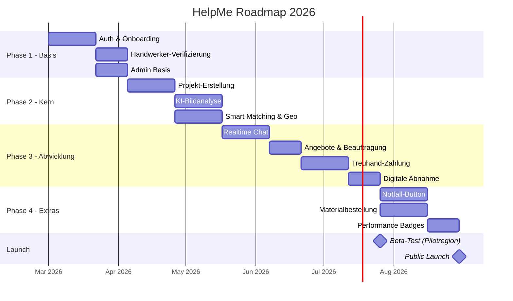

# 📅 HelpMe – Phasen & Roadmap

> Sprint-Planung, Meilensteine und Go-To-Market-Strategie.

---

## Übersicht aller Phasen

---

## Phase 1: Die Basis (Onboarding & Identity)
**Dauer:** ~5 Wochen │ **Ziel:** Nutzer können sich registrieren und verifizieren

### Sprint 1 (Woche 1-2)
| Ticket | Story Points | Beschreibung |
|---|---|---|
| Story 1.1 | 5 SP | Supabase Setup, Auth, Datenbank-Schema |
| Story 1.2 | 3 SP | Split-Screen Onboarding UI |
| Design System | 5 SP | Flutter ThemeData, AppColors, AppTypography, Basis-Widgets |

**Sprint-Ziel:** Nutzer können sich registrieren, Rolle wählen, auf ein leeres Dashboard gelangen.

### Sprint 2 (Woche 3-5)
| Ticket | Story Points | Beschreibung |
|---|---|---|
| Story 1.3 | 8 SP | Handwerker-Profil-Verifizierung |
| Story 1.4 | 5 SP | Handwerker-Profil-Seite (öffentlich) |
| Story 10.1 (Teil 1) | 5 SP | Admin: Verifizierungs-Queue |

**Sprint-Ziel:** Handwerker können Dokumente hochladen, Admin kann prüfen, Profil ist aufrufbar.

### ✅ Meilenstein M1: „Identity Complete"
- Registrierung & Login funktionieren
- Handwerker-Verifizierung durchführbar
- Basis-Admin-Panel verfügbar

---

## Phase 2: Projekt-Erstellung & KI (The Magic)
**Dauer:** ~6 Wochen │ **Ziel:** Kunden können Projekte anlegen, KI analysiert Fotos

### Sprint 3 (Woche 6-8)
| Ticket | Story Points | Beschreibung |
|---|---|---|
| Story 2.1 | 8 SP | Projekt anlegen (Wizard) |
| Story 2.3 | 5 SP | Video-Upload für Projekte |

**Sprint-Ziel:** Kunden können vollständige Projekte mit Fotos/Videos anlegen.

### Sprint 4 (Woche 9-11)
| Ticket | Story Points | Beschreibung |
|---|---|---|
| Story 2.2 | 13 SP | KI-gestützte Schadenserkennung |
| Story 3.1 | 8 SP | Geo-basiertes Matching (PostGIS) |

**Sprint-Ziel:** Hochgeladene Bilder werden analysiert, passende Handwerker gefunden.

### Sprint 5 (Woche 11-13) – Parallel zu Sprint 4
| Ticket | Story Points | Beschreibung |
|---|---|---|
| Story 3.2 | 8 SP | Handwerker-Jobkarte |
| Story 3.3 | 8 SP | Live-Tracking bei Anfahrt |

### ✅ Meilenstein M2: „KI & Matching Live"
- Projekte werden KI-analysiert
- Handwerker werden geo-basiert gematched
- Jobkarte funktioniert

---

## Phase 3: Kommunikation & Abwicklung
**Dauer:** ~10 Wochen │ **Ziel:** Ende-zu-Ende-Flow: Chat → Angebot → Zahlung → Abnahme

### Sprint 6 (Woche 14-16)
| Ticket | Story Points | Beschreibung |
|---|---|---|
| Story 4.1 | 8 SP | Realtime Chat |
| Story 4.2 | 8 SP | Quick-Actions im Chat |

### Sprint 7 (Woche 17-19)
| Ticket | Story Points | Beschreibung |
|---|---|---|
| Story 4.3 | 13 SP | Video-Besichtigung |
| Story 5.1 | 8 SP | Angebot erstellen & senden |

### Sprint 8 (Woche 20-22)
| Ticket | Story Points | Beschreibung |
|---|---|---|
| Story 5.2 | 5 SP | Angebote vergleichen & beauftragen |
| Story 6.1 | 8 SP | Stripe Connect Integration |
| Story 6.2 | 8 SP | Treuhand-Flow (Escrow) |

### Sprint 9 (Woche 23-25)
| Ticket | Story Points | Beschreibung |
|---|---|---|
| Story 6.3 | 13 SP | Digitale Abnahme & Auszahlung |
| Story 9.1 | 5 SP | Bewertungssystem |

### ✅ Meilenstein M3: „MVP Complete" 🎉
- Kompletter Flow von Projekt → Angebot → Zahlung → Abnahme → Bewertung
- **Beta-Launch in Pilotregion möglich!**

---

## Phase 4: Die „Killer"-Extras (Skalierung)
**Dauer:** ~5 Wochen │ **Ziel:** USP-Features für Differenzierung

### Sprint 10 (Woche 26-28)
| Ticket | Story Points | Beschreibung |
|---|---|---|
| Story 7.1 | 13 SP | Notfall-Button |
| Story 8.1 | 13 SP | Materialbestellung |

### Sprint 11 (Woche 29-30)
| Ticket | Story Points | Beschreibung |
|---|---|---|
| Story 7.2 | 5 SP | Notfall-Ready Badge |
| Story 9.2 | 8 SP | Dynamic Performance Badges |
| Story 10.1 (Rest) | 8 SP | Admin: Disputes, Analytics |

### ✅ Meilenstein M4: „Feature Complete"
- Alle geplanten Features implementiert
- **Public Launch!**

---

## Go-To-Market Strategie

### Pilotregion
- **1 Stadt / Region** (z.B. Frankfurt am Main)
- 30-50 Handwerker an Bord holen (persönliche Ansprache)
- 200+ Kunden durch lokales Marketing
- **Ziel:** Product-Market-Fit validieren, Feedback sammeln

### Marketing-Kanäle
| Kanal | Zielgruppe | Maßnahme |
|---|---|---|
| **Instagram / TikTok** | Kunden (25-45) | Vorher/Nachher Content |
| **Handwerker-Messen** | Handwerker | Demo-Stand, Flyer |
| **Google Ads** | Kunden mit Akut-Problem | „Handwerker sofort finden" |
| **Lokale Medien** | Breite Öffentlichkeit | Pressemitteilungen, Startup-Features |
| **Partnerschaften** | B2B | Hausverwaltungen, Makler |
| **Referral System** | Bestandskunden | „Freunde werben, €20 Guthaben" |

### KPIs für Launch-Erfolg
| KPI | Ziel (3 Monate nach Launch) |
|---|---|
| Registrierte Kunden | 500+ |
| Verifizierte Handwerker | 50+ |
| Abgeschlossene Projekte | 100+ |
| Durchschnittliche Bewertung | 4.5+ |
| Conversion (Projekt→Buchung) | 25%+ |
| Repeat-Rate Kunden | 15%+ |

---

## Team-Vorschlag (MVP)

| Rolle | Anzahl | Fokus |
|---|---|---|
| **Flutter Dev** | 2 | Flutter/Dart, Supabase, Riverpod, UI |
| **Backend Dev** | 1 | Supabase Edge Functions, Stripe, PostGIS |
| **Designer** | 1 | UI/UX, Illustrationen, Design System |
| **PO / Product** | 1 | Backlog, Stakeholder, User Research |
| **QA** | 0.5 | Testing, Abnahme (kann PO mitmachen) |
| **DevOps** | 0.5 | CI/CD, Fastlane, Monitoring (kann Dev mitmachen) |
